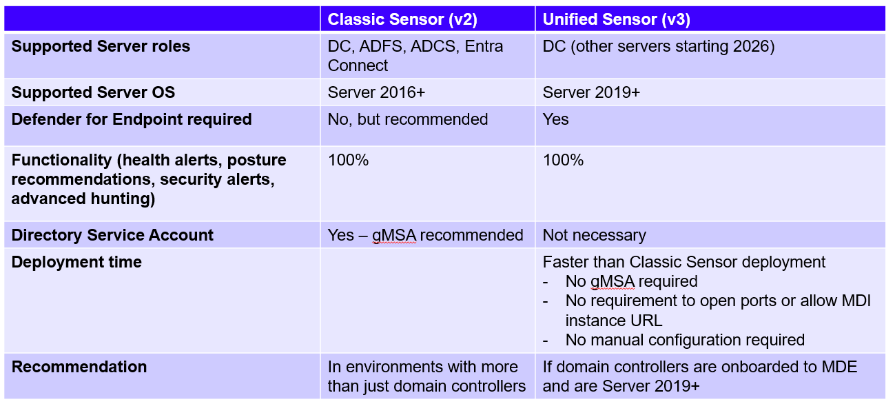
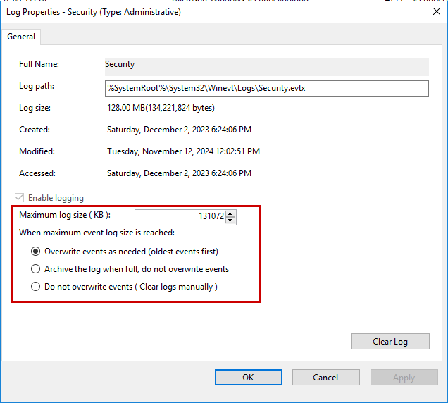
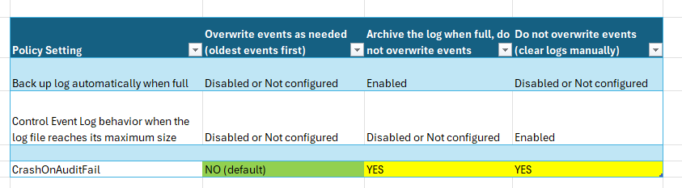
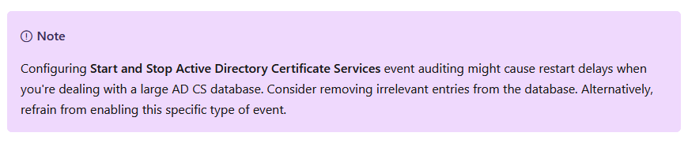
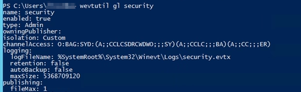
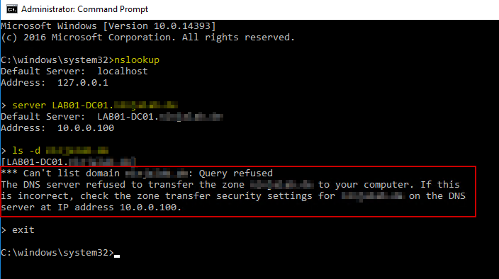

# Introduction
This document describes the (manual) steps involved to onboard servers to Microsoft Defender for Identity using the v2 (classic sensor). It is intended to be used as a checklist.

# Microsoft Defender for Identity (MDI)
Microsoft Defender for Identity (abbreviated MDI, formerly known as Azure Advanced Threat Protection [Azure ATP]) is a cloud-based security solution that leverages on-premises Active Directory signals to identify, detect, and investigate advanced threats, compromised identities, and malicious insider actions directed at your organization.
Defender for Identity detects advanced attacks in hybrid environments to:
- Monitor users, entity behavior, and activities with learning-based analytics
- Protect user identities and credentials stored in Active Directory
- Identify and investigate suspicious user activities and advanced attacks throughout the kill chain
- Provide clear incident information on a simple timeline for fast triage
- Reduce the attack surface

The MDI sensor can be installed on domain controllers, ADFS, ADCS and Entra Connect servers.


_Figure 1: Defender for Identity architecture_

**Sources**
- [What is Microsoft Defender for Identity? | Microsoft Docs](https://learn.microsoft.com/en-us/defender-for-identity/what-is)
- [Microsoft Defender for Identity architecture | Microsoft Docs](https://learn.microsoft.com/en-us/defender-for-identity/architecture)

---

# Prerequisites
## Server OS
Supported Windows Server OS (core and GUI)
- 2016
- 2019
- 2022
- 2025
- Min. 2 CPU cores
- Min. 6GB RAM
- Min. 6GB disk space
- Minimum .NET Framework 4.7 installed

**Sources**
- [Microsoft Defender for Identity prerequisites | Microsoft Docs](https://learn.microsoft.com/en-us/defender-for-identity/prerequisites)

### Defender for Identity Classic vs Unified Sensor

_Figure 2: Defender for Identity Sensor Comparison Chart_

**Decision**

Decide if you want to install the classic sensor (v2) or unified sensor (v3) on domain controllers. You can also mix and match in your environment, e.g. installing the classic sensor on some domain controllers and activate the unified sensor on the other DCs.
As of 1/27/2026 non-domain controllers (ADFS, ADCS, Entra Connect) can only be covered by the classic sensor.

---

### Defender for Identity PowerShell Module
It might be useful to utilize the MDI PowerShell module instead of manually configuring the settings during deployment. If the configuration setting is supported by the PS module it will speed up your deployment and also minimize errors while manually configuring these settings.

The specific cmdlets are mentioned at each configuration step.

To install the module run the following commands:

```PowerShell
Install-Module DefenderForIdentity
Import-Module DefenderForIdentity
```
To update the module:

```PowerShell
Update-Module DefenderForIdentity
```

**Sources**
- [Defender for Identity PowerShell module | Microsoft Docs](https://learn.microsoft.com/en-us/powershell/defenderforidentity/overview-defenderforidentity?view=defenderforidentity-latest)

---

### Checklist – Prerequisites – Server OS

- [ ] Run MDI sizing tool on one domain controller in (each) domain for 24 hours
  - [Download MDI Sizing Tool](https://aka.ms/mdi/sizingtool)
- [ ] Command to run: TriSizingTool.exe -UseCurrent=ComputerDomain (optional: -AlsoEnumerateAD)
- [ ] Check “Azure ATP Summary” tab in created Excel spreadsheet and increase CPU, RAM and/or HDD for each server accordingly
- [ ] Is the latest version of Windows Server OS installed?
- [ ] Set **Power Option** to **High Performance**** **on all servers where MDI will be deployed
  - **GUI**: Start > Control Panel > Power Options > Select a power plan > *Select* Change settings that are currently unavailable > *Choose* High Performance
  - **Command** (as admin): powercfg.exe /setactive 8c5e7fda-e8bf-4a96-9a85-a6e23a8c635c
  - **GPO**: Policies > Administrative Templates > System > Power Management > Select an active power plan > High Performance
  - **MDI PS** cmdlet: `Set-MDIConfiguration -Mode Domain -Configuration ProcessorPerformance`
- [ ] Verify that servers have at least 10GB of disk space for MDI sensor
- [ ] Verify that .NET 4.7 Framework is installed on every server (MDI sensor will install required version automatically) **REBOOT** required (if installation is needed)
  - `Get-ItemPropertyValue -LiteralPath 'HKLM:SOFTWARE\Microsoft\NET Framework Setup\NDP\v4\Full' -Name Release`
  - [.NET Release version overview | Microsoft Docs](https://learn.microsoft.com/en-us/dotnet/framework/migration-guide/how-to-determine-which-versions-are-installed#minimum-version)
- [ ] If servers are virtualized ensure that memory is allocated to VMs at all times
  - [Plan capacity for Microsoft Defender for Identity deployment - Dynamic memory | Microsoft Docs](https://learn.microsoft.com/en-us/defender-for-identity/prerequisites#dynamic-memory-requirements)
- [ ] If servers are virtualized (**VMWare only**) disable TCP Segmentation Offload (TSO) for IPv4 May require **REBOOT** and causes brief **LOSS** of network connectivity
  - `*Get-**NetAdapterAdvancedProperty** | Where-Object DisplayName -Match "^Large*"*`
  - [VMware virtual machine sensor issue | Microsoft Docs](https://learn.microsoft.com/en-us/defender-for-identity/troubleshooting-known-issues#vmware-virtual-machine-sensor-issue)

## Network, Proxy and Ports

### Checklist – Prerequisites – Network Connectivity

- [ ] Create MDI instance in Defender XDR portal (Settings > Identities) and copy workspace name (Settings > Identities > About)
- [ ] Is a proxy required to access the internet?
	- Start > Control Panel > Internet Options > Connections > LAN settings
	- Note configuration – either Automatic configuration/AutoConfigURL or Proxy Server/ProxyServer
	- Link: 
- [ ] Either use proxy or allow URL from first step on all servers where MDI sensor will be deployed https://WORKSPACE-NAMEsensorapi.atp.azure.com
- [ ] Load URL https://WORKSPACE-NAMEsensorapi.atp.azure.com/tri/sensor/api/ping
  - In browser: Should show string with numbers, e.g. “2.240.18316.65180”
  - PowerShell/cmd:
    - `Invoke-Webrequest -UseBasicParsing https://INSTANCE-NAMEsensorapi.atp.azure.com/tri/sensor/api/ping #-Proxy http://PROXYURL` or
    - `wget -UseBasicParsing https:/INSTANCE-NAMEsensorapi.atp.azure.com/tri/sensor/api/ping | % {$_.StatusCode}`
    - Result: Either command should return 200 (or Error 503)
- [ ] Check certificate. If invalid:
  - [Proxy authentication problem | Microsoft Docs](https://learn.microsoft.com/en-us/defender-for-identity/troubleshooting-known-issues#proxy-authentication-problem-presents-as-a-connection-error)
- [ ] Confirm that required ports are open. This step can also be disregarded before rolling out MDI. If a sensor is unable to access specific ports (e.g. for NNR) a sensor health alert be surfaced.
  - [Required ports | Microsoft Docs](https://learn.microsoft.com/en-us/defender-for-identity/deploy/prerequisites-sensor-version-2#required-ports)

## Directory Service Account

- [ ] Check if KDS root key exists: *Get-**KDSRootKey*
- [ ] If not, create via Add-KdsRootKey -EffectiveImmediately and wait 24 hours for synchronization between domain controllers
- [ ] Create a universal AD security group and add all domain controllers (and ADFS/ADCS/Entra Connect) as members
  - AD FS: Add only federation servers (web application proxy servers [WAP] not required) and dedicated SQL server (if AD FS database does not run on local AD FS server)
  - AD CS: Add only online ADCS servers (not required for offline servers)
  - Entra Connect: Add both active and staging servers
- [ ] Create gMSA following your naming convention - choose one of the following options to create the gMSA and give access to specific ressources that can manage the gMSA's password

**Option 1** - Create gMSA with access for one security group
```PowerShell
Import-Module ActiveDirectory
$gMSA_AccountName = 'gmsa-mdi'
$gMSA_HostsGroup = Get-ADGroup 'NAME OF YOUR GROUP CREATED ABOVE'

# Create gMSA
New-ADServiceAccount -Name $gMSA_AccountName -DNSHostName "$gMSA_AccountName.$env:USERDNSDOMAIN" -PrincipalsAllowedToRetrieveManagedPassword $gMSA_HostsGroup.Name -KerberosEncryptionType AES256 # –ManagedPasswordIntervalInDays 30
```

**Option 2** - Create gMSA with access for only domain controllers
```PowerShell
Import-Module ActiveDirectory
$gMSA_AccountName = 'gmsa-mdi'
$gMSA_HostsGroup = (Get-ADGroup -Identity 'Domain Controllers').Name # for German OS use 'Domänencontroller'

# Create gMSA
New-ADServiceAccount -Name $gMSA_AccountName -DNSHostName "$gMSA_AccountName.$env:USERDNSDOMAIN" -PrincipalsAllowedToRetrieveManagedPassword $gMSA_HostsGroup –KerberosEncryptionType AES256 # –ManagedPasswordIntervalInDays 30
```

**Option 3** - Create gMSA with access for domain controllers and security group
```PowerShell
Import-Module ActiveDirectory
$gMSA_AccountName = 'gmsa-mdi-2'
$gMSA_HostsGroupA = (Get-ADGroup -Identity 'Domain Controllers').Name # for German OS use 'Domänencontroller'
$gMSA_HostsGroupB = (Get-ADGroup -Identity 'NAME OF YOUR GROUP CREATED ABOVE').Name # Change name of hosts group

# Create gMSA
New-ADServiceAccount -Name $gMSA_AccountName -DNSHostName "$gMSA_AccountName.$env:USERDNSDOMAIN" -PrincipalsAllowedToRetrieveManagedPassword "$gMSA_HostsGroupA","$gMSA_HostsGroupB" –KerberosEncryptionType AES256 # –ManagedPasswordIntervalInDays 30
```

- [ ] Declare read access (change gMSA name in last line, if necessary)

```PowerShell
# Take ownership on deleted objects container
dsacls "CN=Deleted Objects,$((Get-ADDomain).DistinguishedName)" /takeownership
 
# Grant 'List Contents' and 'Read Property' permissions to gMSA:
dsacls "CN=Deleted Objects,$((Get-ADDomain).DistinguishedName)" /g "$((Get-ADDomain).NetBIOSName)\gmsa-mdi`$:LCRP" # ` needs to be kept in gMSA
```

- [ ] Repeat above steps to create more gMSAs in each domain that have not a full trust established with each other (if applicable)
- [ ] A reboot of all computer objects that were added to the above universal security group will be necessary. Otherwise, the next step will return false.
- [ ] Install and test gMSA

```PowerShell
Import-Module ActiveDirectory
Install-ADServiceAccount -Identity 'gmsa-mdi’
Test-ADServiceAccount -Identity 'gmsa-mdi’ # Should return true
```

- [ ] Optional: See properties of gMSA

```PowerShell
Get-ADServiceAccount gmsa-mdi -Properties * | fl
Get-ADServiceAccount gmsa-mdi -Properties * | fl DNSHostName, SamAccountName, KerberosEncryptionType, ManagedPasswordIntervalInDays, PrincipalsAllowedToRetrieveManagedPassword
```

## Event Logging
### Checklist – Event Logging

- [ ] Run gpresult /h C:\temp\mdi-gpo-result.html (adjust path and file name accordingly) OR use rsop.msc (run both as administrator) on DC and other server (ADFS, ADCS, Entra Connect – if applicable). 

Use created HTML with GPOs (or evaluate RSOP) to determine if the following policies are already configured through existing GPOs.
- If policies are configured, confirm if settings are set correctly. If not, set them according to the documentation (see links below for each section),
- If policies are not configured, create dedicated GPO and set them according to the documentation.

#### Event Log Service

In rare circumstances security events (in security event log) are not allowed to be overwritten. This means that the events will eventually hit the maximum event log size and trigger the CrashOnAuditFail safety feature ([CrashOnAuditFail | Microsoft Docs](https://learn.microsoft.com/en-us/previous-versions/windows/it-pro/windows-2000-server/cc963220(v=technet.10))). Once this is set up only administrators are able (and allowed) to log into a domain controller. This can cause severe outages.

For more information about this feature, the cause, effects and solution visit [Users cannot access Web sites when the security event log is full | Microsoft Docs](https://learn.microsoft.com/en-us/troubleshoot/developer/webapps/iis/health-diagnostic-performance/users-cannot-access-web-sites-when-log-full).

This feature might cause issues in your environment (especially domain controllers) as the MDI sensors will increase the amount of security events.

Check the security event log properties on domain controllers to evaluate if this might affect your environment.

- [ ] Open Event Viewer > Security > Properties
- [ ] Verify which setting is currently enabled (“When maximum event log size is reached:”)



_Figure 3: Security Log Properties_

If “**Archive the log when full, do not overwrite events**” or “**Do not overwrite events (clear logs manually)**” is selected, then the likelihood that the CrashOnAuditFail feature will block non-administrators to log in is high once MDI is deployed.

To change (or confirm) check the following policies under **Computer Configuration > Administrative Templates > Windows Components > Event Log Service > Security**

- Back up log automatically when full
- Control Event Log behavior when the log file reaches its maximum size

See the following table to determine if your domain controllers might be susceptible to CrashOnAuditFail.



_Figure 4: Summary of CrashOnAuditFail options_

---

#### Policies for **domain controllers and other servers where MDI will be installed (ADFS, ADCS, Entra Connect)**

- [ ] **Log on as a service**
  - Policies > Windows Settings > Security Settings > Local Policies > User Rights Assignment
  - **Default**: Local security policy (NT SERVICE\ALL SERVICES)
  - If enabled, add gMSA(s) (created above) to policy
  - **ATTENTION**
    - User Rights Assignment GPO will overwrite locally made changes, e.g. Entra Connect connector account will be overwritten by GPO.
      - Get current Entra Connect connector account via Get-ADSyncADConnectorAccount and add to GPO targeting Entra Connect servers. NT SERVICE\ALL SERVICES covers NT SERVICE\ADSync if the Microsoft Azure AD Sync service is running with that account.
    - Ideally NT SERVICE\ALL SERVICES should be added to GPO, if not already added. Simply type NT SERVICE\ALL SERVICES in the user and group names box (don’t click browse!)
    - Consider configuring this setting on ADFS, ADCS and Entra Connect via local group policy (“edit group policy”).
  - [Log on as a service | Microsoft Docs](https://learn.microsoft.com/en-us/defender-for-identity/deploy/create-directory-service-account-gmsa#verify-that-the-gmsa-account-has-the-required-rights)

---

#### Policies for **domain controllers**

- [ ] **Advanced Auditing Policies**
  - **ATTENTION**
    - Setting Advanced Audit Policies will **overwrite** legacy audit policies (Policies > Windows Settings > Security Settings > Local Policies > Audit Policy) and you will not be able to switch back. **This could break on-premises solutions that rely on specific event IDs!**
    - Before making any changes output all events currently being logged via `auditpol /get /category:*`
    - Then consider migrating them over from Local Policies > Audit Policy to Advanced Audit Policies.
  - There might be problems with configuring the Advanced Audit Policies manually through GPO, e.g. they won’t apply to the domain controllers. Either configure these settings in the `Default Domain Controllers` policy or use the MDI PowerShell cmdlet (apply to DCs after creation) - `Set-MDIConfiguration -Mode Domain -Configuration AdvancedAuditPolicyDCs -CreateGpoDisabled`
  - To create the GPO manually follow the next steps:
  - Policies > Windows Settings > Security Settings > Advanced Audit Policy Configuration > Audit Policies
  - Select **Success** and **Failure** for following categories
    - Account Logon > Audit Credential Validation
    - Account Management > Audit Computer Account Management
    - Account Management > Audit Distribution Group Management
    - Account Management > Audit Security Group Management
    - Account Management > Audit User Account Management
    - DS Access > Audit Directory Service Access
    - DS Access > Audit Directory Service Changes
    - System > Audit Security System Extension
  - [Configure Directory Services Advanced Auditing | Microsoft Docs](https://learn.microsoft.com/en-us/defender-for-identity/deploy/configure-windows-event-collection#configure-directory-services-advanced-auditing)

- [ ] **Event ID 8004 (NTLM)**
  - MDI PS cmdlet: `Set-MDIConfiguration -Mode Domain -Configuration NTLMAuditing -CreateGpoDisabled`
  - To create the GPO manually follow the next steps:
  - Policies > Windows Settings > Security Settings > Local Policies > Security Options
  - Configure following policies:
    - Network security: Restrict NTLM: Outgoing NTLM traffic to remote servers > **Audit all**
    - Network security: Restrict NTLM: Audit NTLM authentication in this domain > **Enable all**
    - Network security: Restrict NTLM: Audit Incoming NTLM Traffic > **Enable auditing for all accounts**
  - [Configure NTLM auditing | Microsoft Docs](https://learn.microsoft.com/en-us/defender-for-identity/deploy/configure-windows-event-collection#configure-ntlm-auditing)

---

#### Policies for Active Directory Federation Services (AD FS) servers
-- > **Only configure the below policies on a server OS that has the Active Directory Federation Services (AD FS) role installed!** <--

- [ ] **Configure Verbose logging for AD FS events**
  - Only run on primary server of the AD FS farm

```PowerShell
# Get current AuditLevel on AD FS server (Basic = default)
Get-AdfsProperties | select AuditLevel

# Set AuditLevel to Verbose
Set-AdfsProperties -AuditLevel Verbose
```
  - [Configure Verbose logging for AD FS events | Microsoft Docs](https://learn.microsoft.com/en-us/defender-for-identity/deploy/configure-windows-event-collection#configure-verbose-logging-for-ad-fs-events)

- [ ] **Configure read permissions for the AD FS database**
  - Applies read (db_datareader) permissions for the gMSA(s)
  - Apply the steps below on all AD FS servers in your environment since database permissions are not replicated across servers.
  - If AD FS database is located on dedicated SQL server, add SQL server to AD security group that can access the gMSA (see ).
  - To acquire SQL connection string (if not known already) to locate the name of the AD FS database open PowerShell
    - [Acquire the SQL database connection string | Microsoft Docs](https://learn.microsoft.com/en-us/windows-server/identity/ad-fs/troubleshooting/ad-fs-tshoot-sql#acquire-the-sql-database-connection-string)
```PowerShell
$adfs = gwmi -Namespace root/ADFS -Class SecurityTokenService
$adfs.ConfigurationDatabaseConnectionString
```

  - Grant sensor access to AD FS database using PowerShell (run as administrator)
    - Adjust the below code to your environment
    - [**DOMAIN1\gmsa-mdi$**] - the directory services account of the workspace, e.g. [YOURDOMAIN\gmsa-mdi$]” (**don’t forget the dollar sign at the end of the gMSA**)
    - **AdfsConfigurationV4** - the name of the AD FS database (see connection string from previous step)
    - **server=.\pipe\MICROSOFT##WID\tsql\query** - the connection string to the database if you are using WID
  - [Grant access to the AD FS database | Microsoft Docs](https://learn.microsoft.com/en-us/defender-for-identity/deploy/active-directory-federation-services#grant-access-to-the-ad-fs-database)

```PowerShell
$ConnectionString = 'server=\\.\pipe\MICROSOFT##WID\tsql\query;database=AdfsConfigurationV4;trusted_connection=true;'
$SQLConnection= New-Object System.Data.SQLClient.SQLConnection($ConnectionString)
$SQLConnection.Open()
$SQLCommand = $SQLConnection.CreateCommand()
$SQLCommand.CommandText = @"
USE [master]; 
CREATE LOGIN [DOMAIN1\gmsa-mdi$] FROM WINDOWS WITH DEFAULT_DATABASE=[master];
USE [AdfsConfigurationV4]; 
CREATE USER [DOMAIN1\gmsa-mdi$] FOR LOGIN [DOMAIN1\gmsa-mdi$]; 
ALTER ROLE [db_datareader] ADD MEMBER [DOMAIN1\gmsa-mdi$]; 
GRANT CONNECT TO [DOMAIN1\gmsa-mdi$]; 
GRANT SELECT TO [DOMAIN1\gmsa-mdi$];
"@
$SqlDataReader = $SQLCommand.ExecuteReader()
$SQLConnection.Close()
```

---

#### Policies for Active Directory Certificate Services (AD CS) servers
-- > **Only configure the below policies on a server OS that has the Active Directory Certificate Services (AD CS) role installed!** <--

- [ ] **Audit Certification Services**
  - **ATTENTION**
    - Setting Advanced Audit Policies will **overwrite** legacy audit policies (Policies > Windows Settings > Security Settings > Local Policies > Audit Policy) and you will not be able to switch back. **This could break on-premises solutions that rely on specific event IDs!**
    - Before making any changes output all events currently being logged via `auditpol /get /category:*`
    - Then consider migrating them over from Local Policies > Audit Policy to Advanced Audit Policies.
  - MDI PS cmdlet: `Set-MDIConfiguration -Mode Domain -Configuration AdvancedAuditPolicyCAs -CreateGpoDisabled`
  - To create the GPO manually follow the next steps:
  - Create separate GPO for AD CS server(s), if not configured in GPO already.
  - Policies > Windows Settings > Security Settings > Advanced Audit Policy Configuration > Audit Policies > Object Access > Audit Certification Services
    - Select Success and Failure

- [ ] **Configure CA auditing (either via command line or GUI)**
  - Check if CA\AuditFilter value is already set to value 127 (or 7f): `Certutil -getreg CA\AuditFilter`
  - If value is not set to 127 check your ADCS database size as enabling `Start and Stop Active Directory Certificate Services` might cause restart delays
    - Default path for the ADCS database (.edb): %SystemRoot%\System32\CertLog



_Figure 5: Note for logging Start and Stop Active Directory Certificate Services_

  - To enable auditing all events (= set AuditFilter to value 127) use one of the following methods
  - Commandline (as admin)
```
certutil –setreg CA\AuditFilter 127
net stop certsvc && net start certsvc`
```

  - GUI
    - Start > Certification Authority (MMC) > Right-click CA > Properties > Auditing > Select all events > Apply

  - [Configure auditing on AD CS | Microsoft Docs](https://learn.microsoft.com/en-us/defender-for-identity/deploy/configure-windows-event-collection#configure-auditing-on-ad-cs)

---

#### Policy for Entra Connect servers
-- > **Only configure the below setting on an Entra Connect server (active and staging)!** <--

- [ ] **Advanced Auditing Policies**
  - **ATTENTION**
    - Setting Advanced Audit Policies will **overwrite** legacy audit policies (Policies > Windows Settings > Security Settings > Local Policies > Audit Policy) and you will not be able to switch back. **This could break on-premises solutions that rely on specific event IDs!**
    - Before making any changes output all events currently being logged via `auditpol /get /category:*`
    - Then consider migrating them over from Local Policies > Audit Policy to Advanced Audit Policies.
  - There might be problems with configuring the Advanced Audit Policies manually through GPO, e.g. they won’t apply to the domain controllers. Either configure these settings in the `Default Domain Controllers` policy or use the MDI PowerShell cmdlet (apply to DCs after creation) - `Set-MDIConfiguration -Mode Domain -Configuration EntraConnectAuditing -CreateGpoDisabled`
  - To create the GPO manually follow the next steps:
  - Create a separate GPO for Entra Connect server(s), if not configured in GPO already.
  - Policies > Windows Settings > Security Settings > Advanced Audit Policy Configuration > Audit Policies
  - Select **Success** and **Failure** for the following category
    - Logon/Logoff > Audit Logon
  - [Configure auditing on Microsoft Entra Connect | Microsoft Docs](https://learn.microsoft.com/en-us/defender-for-identity/deploy/configure-windows-event-collection#configure-auditing-on-microsoft-entra-connect)

- [ ] **Configure read permissions for the Entra Connect (ADSync) database**
  - The following steps only apply if the Entra Connect database is hosted on an external SQL server instance.
  - Grant the sensor permissions to the SQL database by following the steps at [Configure permissions for the Microsoft Entra Connect (ADSync) database | Microsoft Docs](https://learn.microsoft.com/en-us/defender-for-identity/deploy/active-directory-federation-services#configure-permissions-for-the-microsoft-entra-connect-adsync-database)

---

#### Existing policy to forward security event log

The MDI Sensor (AATPSensor) service needs access to the Windows Security event log. In some environments the Security event log might have been forwarded to an external appliance via GPO.

Assess if the Security event log is being forwarded by checking the following policy.

- [ ] **Configure log access**
  - Computer Configuration > Administrative Templates > Windows Components > Event Log Service > Security > **Configure log access** or **Configure log access (legacy)**
  - **Default**: Not enabled
  - If the policy **is enabled** run command `wevtutil gl security` (as admin) and backup the output (see figure 6).
  - In the policy append `(A;;0x1;;;S-1-5-80-818380073-2995186456-1411405591-3990468014-3617507088)` to the existing values (this is the SID of the AATPSensor service).
  - Confirm with command `wevtutil gl security` (as admin) that the SID was added (under channelAccess, see figure 7).
  - [Sensor fails to enumerate event logs | Microsoft Docs](https://learn.microsoft.com/en-us/defender-for-identity/troubleshooting-known-issues#sensor-fails-to-enumerate-event-logs)

**Examples**



_Figure 6: MDI Sensor - Security Event Log Access (before)_


_Figure 7: MDI Sensor - Security Event Log Access (after)_

---

### Checklist – Auditing

- [ ] Confirm if object auditing was already configured in your domain. If not, make changes according to documentation (see links below for each section).
- [ ] **Configure object auditing** (Event ID 4662)
  - MDI PS cmdlet: `Set-MDIConfiguration -Mode Domain -Configuration DomainObjectAuditing`
  - To manually configure follow the next steps:
  - Active Directory Users and Computers console > Select Domain > Properties > Security > Advanced > Auditing > Add
  - Create one entry for
    - Descendant User objects
    - Descendant Group Objects
    - Descendant Computer Objects
    - Descendant msDS-GroupManagedServiceAccount Objects
    - Descendant msDS-ManagedServiceAccount Objects
    - Descendant msDS-DelegatedManagedServiceAccount Objects (if applicable)
  - Steps to repeat for each entry
    - Principal: Everyone
    - Type: Success
    - Applies to: [see list above]
    - *Clear all* (all the way at the bottom) - scroll down and up using the scrollbar on the right. This menu behaves sluggish/wonky.
    - Check *Full Control*
    - Uncheck *List contents*
    - Uncheck *Read all properties*
    - Uncheck *Read permissions*
  - [Configure domain object auditing | Microsoft Docs](https://learn.microsoft.com/en-us/defender-for-identity/deploy/configure-windows-event-collection#configure-domain-object-auditing)

---

- [ ] **Enable auditing on an Exchange object**
  - Confirm if this is needed in your environment. If yes, follow steps in below documentation.
  - MDI PS cmdlet: `Set-MDIConfiguration -Mode Domain -Configuration ConfigurationContainerAuditing`
  - To manually configure follow the next steps:
  - Open ADSI Edit (ADSIEdit.msc)
  - Action > Connect to
  - Connection Settings (under Select a well known Naming Context) > Select Configuration > OK
  - Expand Configuration container > Right-click Configuration node > Properties
  - Security > Advanced > Auditing > Add
  - Make following selections
    - Principal: Everyone
    - Type: All
    - This object and all descendant objects
    - *Clear all* (all the way at the bottom) - scroll down and up using the scrollbar on the right. This menu behaves sluggish/wonky.
    - Check *Write all properties*
    - Select OK
  - [Configure auditing on the configuration container | Microsoft Docs](https://learn.microsoft.com/en-us/defender-for-identity/deploy/configure-windows-event-collection#configure-auditing-on-the-configuration-container)

---

- [ ] **Enable auditing on an ADFS object**
  - Confirm if this is needed in your environment. If yes, follow steps in below documentation.
  - MDI PS cmdlet: `Set-MDIConfiguration -Mode Domain -Configuration AdfsAuditing`
  - To manually configure follow the next steps:
  - Active Directory Users and Computers console > Your Domain > Program Data > Microsoft > Select ADFS > Properties > Security > Advanced > Auditing > Add
  - Make following selections
    - Principal: Everyone
    - Type: All
    - Applies to: This object and all descendant objects
    - *Clear all* (all the way at the bottom) - scroll down and up using the scrollbar on the right. This menu behaves sluggish/wonky.
    - Check *Read all properties*
    - Check *Write all properties*
  - [Configure auditing on AD FS | Microsoft Docs](https://learn.microsoft.com/en-us/defender-for-identity/deploy/configure-windows-event-collection#configure-auditing-on-ad-fs)

# MDI Sensor
## Checklist – MDI Instance
- [ ] Download MDI sensor package from Defender XDR portal - **Settings > Identities > Sensors > Add Sensor**
- [ ] Collect access key - this key will only be used for initial communication between sensor and MDI instance
- [ ] Add gMSA(s) as directory service account to Defender XDR portal
  - [Configure a Directory service account in Microsoft Defender XDR | Microsoft Docs](https://learn.microsoft.com/en-us/defender-for-identity/deploy/create-directory-service-account-gmsa#configure-a-directory-service-account-in-microsoft-defender-xdr)
- [ ] Does the server need a proxy to communicate to MDI URLs? If so, do you have the proxy information handy?

## Checklist – Install MDI Sensor
- [ ] Run installation packages on all servers where MDI needs to be installed, either silently or via GUI, depending on which proxy option is needed.

### Without proxy
- Silent: `"Azure ATP Sensor Setup.exe" /quiet NetFrameworkCommandLineArguments="/q" AccessKey="ACCESS KEY"`
- GUI: Run installation package and manually enter access key

### With non-authenticated proxy
- Silent: `"Azure ATP Sensor Setup.exe" /quiet ProxyUrl="http://IPorURL:PORT" NetFrameworkCommandLineArguments="/q" AccessKey="ACCESS KEY"`
- GUI: `"Azure ATP Sensor Setup.exe" ProxyUrl="http://IPorURL:PORT"`

### With authenticated proxy
- Silent: `"Azure ATP Sensor Setup.exe" /quiet ProxyUrl="http://IPorURL:PORT" NetFrameworkCommandLineArguments="/q" ProxyUserName="DOMAIN\USER" ProxyUserPassword="PASSWORD" AccessKey="ACCESS KEY"`
- GUI: `"Azure ATP Sensor Setup.exe" ProxyUrl="http://IPorURL:PORT" ProxyUserName="DOMAIN\USER" ProxyUserPassword="PASSWORD"`

## Checklist – Confirm MDI Sensor Install
- [ ] Confirm that *AATPSensor* and *AATPSensorUpdater* services are running
  - PowerShell: `Get-Service AATPSensor, AATPSensorUpdater`
- [ ] Run MDI configuration checker tool (as **administrator**)
  - Disclaimer
    - The tool might display the wrong information for non-English Windows Server OS, e.g. Object Auditing or Exchange Auditing is displayed as not configured. If you are using a non-English OS version please confirm that the policies have been configured properly and that the sensor health status (see checkbox below) in the Defender XDR portal does not show any issues.
  - [Test-MdiReadiness.ps1 | GitHub](https://github.com/microsoft/Microsoft-Defender-for-Identity/tree/main/Test-MdiReadiness)
  - **ATTENTION**
  - This tool will query all DCs, ADCS and Entra Connect servers in your domain. It might create incidents/alerts in the Defender XDR or other EDR solutions. Some features will get blocked if Attack Surface Reduction rules (ASR) are in block mode.
  - You might need to set the PowerShell execution policy to unrestricted to run this script. Please confirm if it is allowed to change the execution policy in your environment.
  - Run with PowerShell:
    - `.\Test-MdiReadiness.ps1` OR
    - `.\Test-MdiReadiness.ps1 -domain YOUR-DOMAIN` (e.g. abc.domain.local)
- [ ] If Test-MDIReadiness HTML shows **False** for Advanced Auditing and/or PowerSettings it could be that remotely accessing this information is blocked.
  - Please manually execute the following commands on one server to confirm that the settings have been made.
  - **AdvancedAuditing**: `auditpol /get /category:*`
  - **PowerSettings**: `powercfg -list` (* means active)
  - It might help to analyze the JSON file that the Test-MDIReadiness tool creates to further troubleshoot.
- [ ] If you installed MDI sensors on ADFS, ADCS and/or Entra Connect servers you will need to add Domain Controllers (FQDN) to the sensors manually to resolve computer and user objects in other domains in the forest.
  - [View and configure sensor settings | Microsoft Docs](https://learn.microsoft.com/en-us/defender-for-identity/deploy/configure-sensor-settings#view-and-configure-sensor-settings)
- [ ] Check sensor health status in Defender XDR
  - Defender XDR portal > Settings > Identities > Health issues
  - There should be no issues for either Global or Sensor Health issues
  - Sign up for sensor health issue notifications
    - Defender XDR portal > System > Settings > Identities > Health issues notifications
- [ ] (If necessary) Adjust Defender XDR Email Notifications
  - Defender XDR portal > System > Settings > Microsoft Defender XDR > Email notifications
  - Add the Defender for Identity source to receive email notifications for MDI incidents

# Simulate alerts

## Network Mapping Reconnaissance (DNS)
- [ ] Run on Windows Client OS joined to domain
- [ ] Open command prompt (non-admin or admin)
- [ ] Enter the following commands
```
nslookup
server [YOUR-DC-NAME].[YOUR-DOMAIN] (example: server DC1.domain.local)
ls -d YOUR.DOMAIN (example: ls -d domain.local)
```
- [ ] **Result**
  - The following message should be displayed: *Can’t list domain [domain name]: Query refused*
  - An alert should be created in Defender XDR with Defender for Identity as source *Network mapping reconnaissance (DNS)*
    - It could be possible that no alert is being triggered as some activities have a learning period of 7-30 days. 



_Figure 8: Simulation Alert Network Mapping Reconnaissance_

## Directory Service Reconnaissance (SAM-R)
- [ ] Run on Windows Client OS joined to domain
- [ ] Open command prompt (non-admin or admin) 
- [ ] Enter following commands
```
net user /domain
net group /domain
net group "Domain Admins" /domain
net group "Enterprise Admins" /domain
```
- [ ] **Result**
  - Should enumerate domain users, domain groups, Domain Admins and Enterprise Admins
  - An alert should be created in Defender XDR with Defender for Identity or EDR as source *Anomalous account lookups*
    - It could be possible that no alert is being triggered as some activities have a learning period of 7-30 days. 

## Data exfiltration over SMB
- **ATTENTION:** This simulation will potentially trigger the automatic attack disruption feature (if you have MDE deployed in the environment)! This means that the domain admin you're using below will be disabled and contained automatically!
- [ ] Download PsTools
- [ ] Run on Windows Client OS joined to domain
- [ ] Open command prompt (run as **domain admin**) 
- [ ] Enter following commands
```
PSEexec -s -i \\DC1.domain.local cmd.exe
vssadmin list shadows

// If no shadow copy exists you can create one with
vssadmin create shadow /for=C:

// Make sure to delete shadow copy after testing with
vssadmin delete shadows /shadow={SHADOW ID}

// Verify last digit in output (HarddiskVolumeShadowCopyX) and add to next command
copy \\?\GLOBALROOT\Device\HarddiskVolumeShadowCopyX\windows\ntds\ntds.dit C:\temp\ntds.dit
```
- [ ] **Result**
  - NTDS.dit should be copied to temporary folder.
  - Multiple alerts should be created in Defender XDR portal, e.g. Suspicious Service launched (PSEXESVC), Suspicious credentials dump from NTDS.dit (if MDE is deployed on server), Lateral movement, Hands-on keyboard attack
